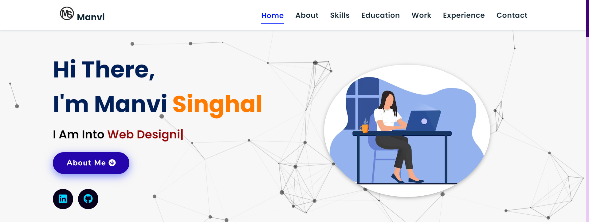

# Portfolio
Portfolio website build using HTML5, CSS3, JavaScript

<a href="https://654902eec2fc091952b4cd3d--gorgeous-dango-f37d94.netlify.app/" target="_blank">**Visit Now** 🚀</a>

## 📌 Tech Stack
[]&nbsp;
[]&nbsp;
[]

## 📌 Sneak Peek of Main Page 🙈 :
![mockup720]
![ss]

<h2>📬 Contact</h2>

If you want to contact me, you can reach me through below handles.

&nbsp;&nbsp;<a href="https://www.linkedin.com/in/manvi-singhal-119232216/"></img></a>

© 2023 Manvi Singhal

